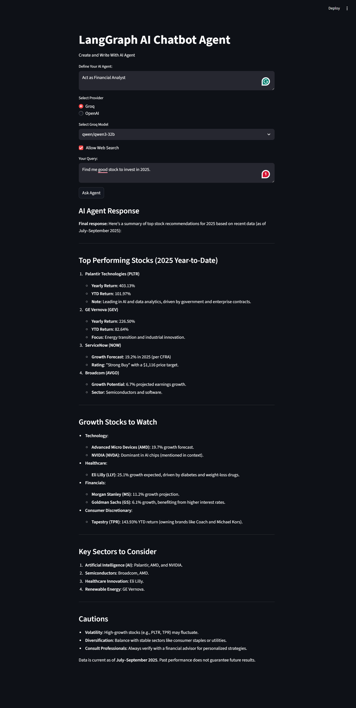

# Agentic Chatbot Using LangGraph & FastAPI

A conversational AI chatbot agent built with FastAPI, Streamlit, and LangGraph, supporting Groq LLMs and web search via Tavily. Easily define your own system prompt, select models, and interact with the agent through a web UI.


## Features

- **FastAPI backend** for serving AI responses.
- **Streamlit frontend** for interactive chat and agent configuration.
- **Supports Groq LLMs** (Qwen, Llama-3).
- **Optional web search** using Tavily.
- **Customizable system prompt** for agent behavior.
- **Environment-based configuration** for API keys and endpoints.

## Project Structure

```
.
├── ai_agent.py         # Core AI agent logic
├── backend.py          # FastAPI backend API
├── frontend.py         # Streamlit frontend UI
├── hello.py            # Simple hello world script
├── .env                # API keys and config
├── pyproject.toml      # Project dependencies
├── README.md           # Project documentation
└── .streamlit/
    └── config.toml     # Streamlit theme config
```

## Setup

### Prerequisites

- Python 3.13+
- [Groq API key](https://console.groq.com/docs/rate-limits)
- [Tavily API key](https://app.tavily.com/home)

### Installation

1. **Clone the repository:**
   ```sh
   git clone <https://github.com/rrpatil-1/Agentic-Chatbot-Using-LangGraph-FastAPI.git>
   cd gentic-Chatbot-Using-LangGraph-FastAPI
   ```

2. **Create and activate a virtual environment:**
   ```sh

   python -m venv .venv
   
   ```
   OR:
   ```sh
   pip install uv
   uv init 
   ```

3. **Install dependencies:**
   ### 2. Install Dependencies

```sh
pip install -r requirements.txt
pip install -r pyproject.toml
```

Or use [uv](https://github.com/astral-sh/uv):

```sh
uv pip install -r requirements.txt
uv pip install -r pyproject.toml
```

4. **Configure environment variables:**

   Create a `.env` file in the project root:
   ```
   GROQ_API_KEY=your-groq-api-key
   TAVILY_API_KEY=your-tavily-api-key
   API_URL=http://localhost:8000/chat
   ```

## Usage

### 1. Start the FastAPI backend

```sh
python backend.py
```
OR:
```sh
uvicorn backend:app
```
The backend will be available at [http://localhost:8000](http://localhost:8000).

### 2. Launch the Streamlit frontend

```sh
streamlit run frontend.py
```

Open the provided URL in your browser to interact with the chatbot.

## Customization

- **Add new models:** Update `ALLOWED_MODELS_NAMES` in `backend.py`.
- **Change agent behavior:** Edit the system prompt in the Streamlit UI.
- **Enable/disable web search:** Use the checkbox in the UI.

## File Overview

- `ai_agent.py`: Defines `get_response_from_ai` for model and tool orchestration.
- `backend.py`: FastAPI app exposing `/chat` endpoint.
- `frontend.py`: Streamlit UI for user interaction.

## License

MIT License

---

*Built with ❤️ using FastAPI, Streamlit, and LangGraph.*